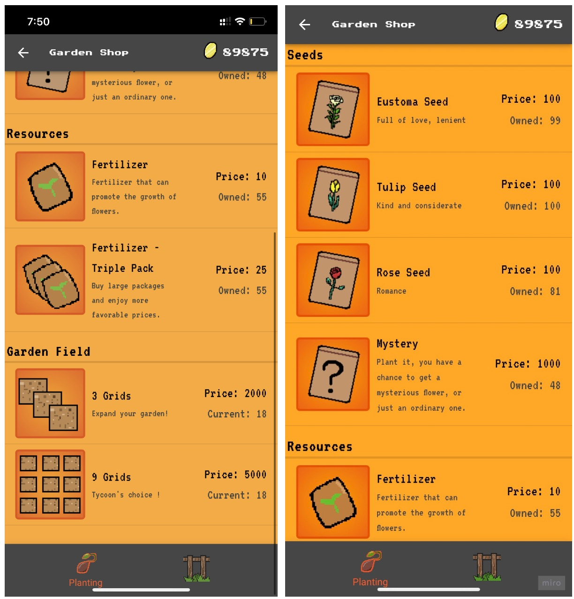
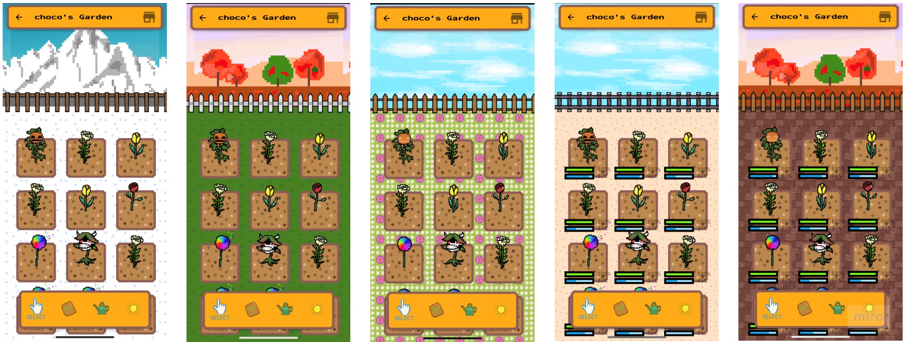
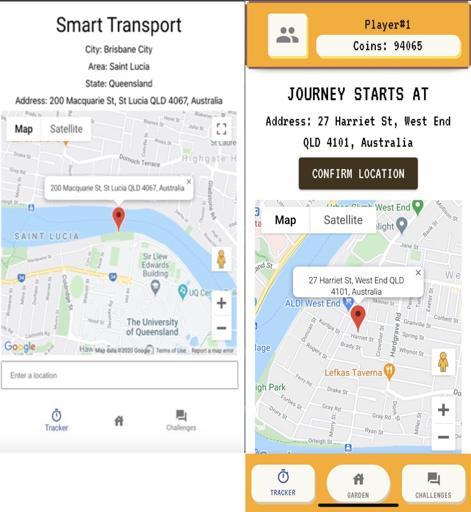

## 作品介绍
本项目为一款web app,主要内容为通过绿色出行的方式来管理自己的花园。此应用是基于现有的粗略原型和概念上开发出的最终成品。

### 作品视频介绍  

### 优化结构
在现有的粗略原型的基础上，我优化了产品的结构。 

  

### 绘制原型  

产品原型主要围绕着定位、花园以及个人进度三个功能进行具体展开。
原型具体细节请前往：

### 迭代管理  

在开发初期，花园部分做出了基本布局以及基本功能。

 

完善花园动画，使花园更加生动。

 

在开发花园的商店部分时，我也产出了商店部分的架构图、选色和图标设计。

   

最终花园效果图一览  

  

在定位部分也进行了一定程度上的迭代，主要为视觉、体验上的优化  

  

迭代更多细节请前往：

### 反思  

尽管开发前设计好原型并且与开发沟通好，还是会在开发过程中产生一些细节上的疑问或临时改动。这个时候需要通过参考经典案例尽快的给出最优解决办法。相信经验越多，解决办法的效率会越高。