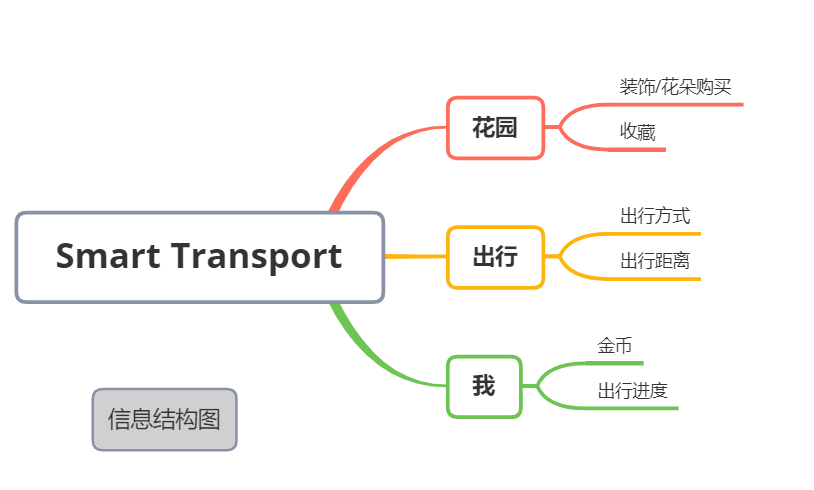
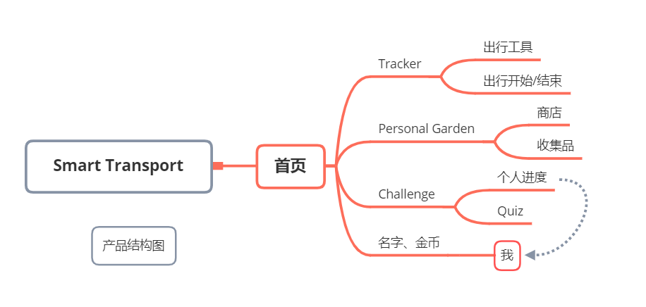

## 作品介绍
本项目为一款web app,主要内容为通过绿色出行的方式来管理自己的花园。此应用是基于现有的粗略原型和概念上开发出的最终成品。以下内容为在该项目中本人主要负责的部分。

### 优化结构
在现有的粗略原型的基础上，我优化了产品的操作流程。 

  

### 绘制原型

### 迭代管理
在开发初期，花园部分做出了基本布局以及基本功能。在这个基础上，我负责了美工部分，产出了多种花园样式的组合。

完善花园动画，使花园更加生动。

在开发花园的商店部分时，我也产出了商店部分的架构图、选色和图标设计。

反思：尽管开发前设计好原型并且与开发沟通好，还是会在开发过程中产生一些细节上的疑问或临时改动。这个时候需要通过参考经典案例尽快的给出最优解决办法。相信经验越多，解决办法的效率会越高。