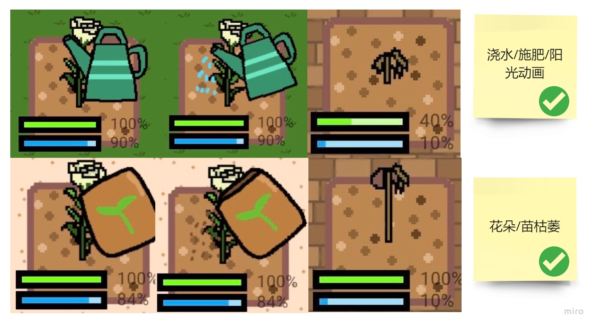

# 作品介绍
本项目为一款web app,主要内容为通过绿色出行的方式来管理自己的花园。此应用是基于现有的产品草案和概念上开发出的最终成品。  
此文档主要介绍了此项目产出的过程以及本人参与了哪些工作。  

项目地址: [https://smart-transport.australiaeast.cloudapp.azure.com/ ](https://smart-transport.australiaeast.cloudapp.azure.com/ )   

以下为本项目的视频介绍 

<iframe src="//player.bilibili.com/player.html?aid=203289530&bvid=BV1Vh411f7AW&cid=272820992&page=1" allowfullscreen="allowfullscreen" width="100%" height="500" scrolling="no" frameborder="0" sandbox="allow-top-navigation allow-same-origin allow-forms allow-scripts"></iframe>

## 优化结构
在现有产品草案的基础上，我优化了产品的结构。 

  

## 流程设计  
通过流程设计，我们明确了实现的细节，并在交流的基础上总结了最终的各项流程。  
行程记录的流程：  

    

花园管理的流程：  

    

商店购买的流程：  

  

## 绘制原型  

产品原型主要围绕着定位、花园以及个人进度三个功能进行具体展开。
原型具体细节请前往：https://www.wulihub.com.cn/go/QAk95b/start.html  

## UI及美工  

这部分我主要负责了整体美术风格的选择、所有美术素材的制作以及整个Web App的配色风格的选择。  

以下为游戏内部所有美术素材的产出：  

  

    

  

以下为配色风格的选择，主要参考了几款相关性游戏的配色风格，并且符合material design的配色标准。  

  

## 迭代管理  

**1.0**   

*花园*  

在开发初期，花园部分做出了基本布局以及基本功能。

  
  

*定位*

定位功能简单实现了利用googleAPI实时定位的功能  

  

**2.0**  

*花园*

完善花园动画，使花园更加生动。

   

增加美术风格，优化代码逻辑。  

 

*定位及成就*  

优化定位界面以及成就系统， 使配色风格保持一致。  

 

**3.0**  

*花园*  

优化种植系统，增添枯萎花朵。  

 

增加商店系统。 

   

花园最终效果一览：  

 

迭代更多细节请前往：https://www.wulihub.com.cn/go/QAk95b/start.html

## 反思  

尽管开发前设计好原型并且与开发沟通好，还是会在开发过程中产生一些细节上的疑问或临时改动。这个时候需要通过参考经典案例尽快的给出最优解决办法。相信经验越多，解决办法的效率会越高。