# 作品介绍
本作品为昆士兰大学工程学院短期项目，主要内容为设计并制作交互性为主的网站。本人与其他三人构成小组，在小组中的主要职责为概念设计、UI、UX以及部分前端编程。以下为该作品的介绍。

### 项目主题
网站主题：以探索为主的解谜网页游戏。  

交互元素：探索地图、回答脑筋急转弯、和人物对话、与室内物品交互以及查看图册人物。  

主要目的：让游玩者在探索中感知地图的作用；在趣味解谜中益智；在点亮图册时了解人物历史背景。

游戏流程为下：

* 坐时光机穿越回战争年代试图找回图书馆丢失的二战士兵照片。
* 探索现有地图中的不同区域。
* 进入房间，发生对话/探索房间/回答问题，寻找沙漏的线索。
* 利用沙漏来点亮士兵照片，查看士兵故事。

以下为此游戏网页中的一些截图:   

    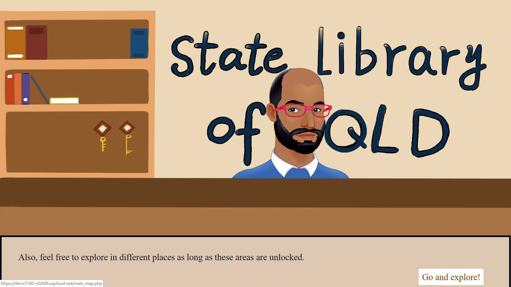
     
    
与图书管理员交流，引出任务

    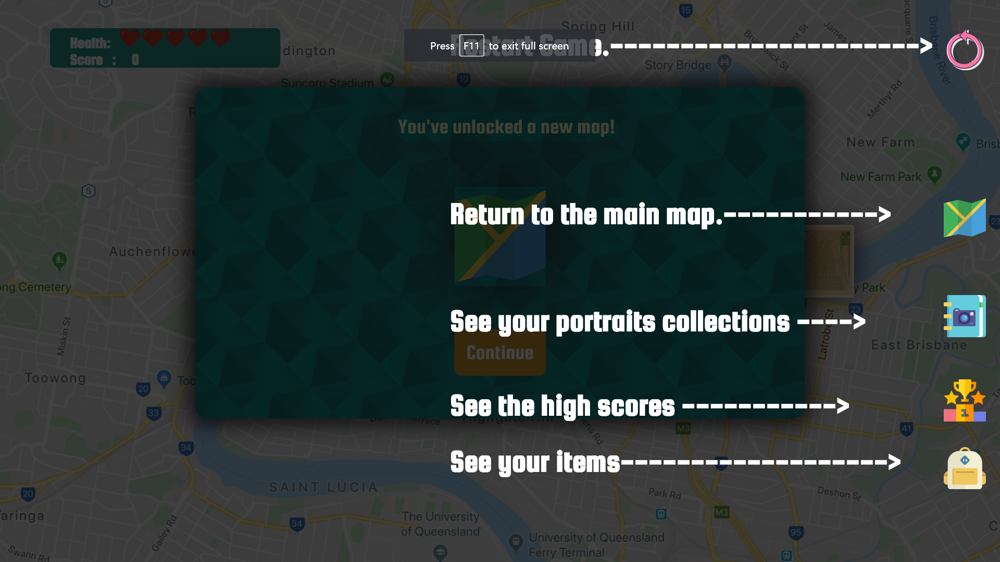
     
    
游戏开始前的指引

    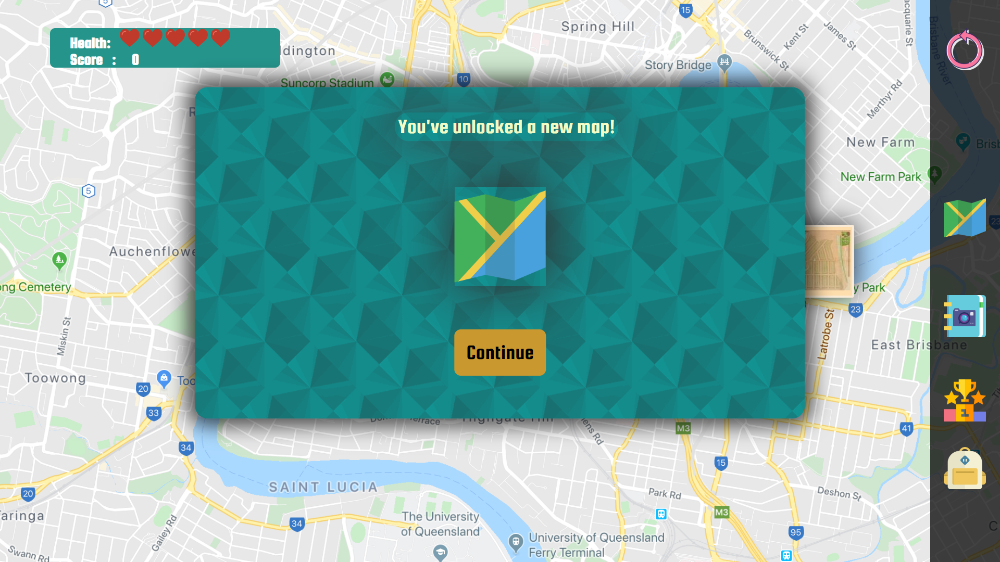
     
    
解锁新地图的界面

    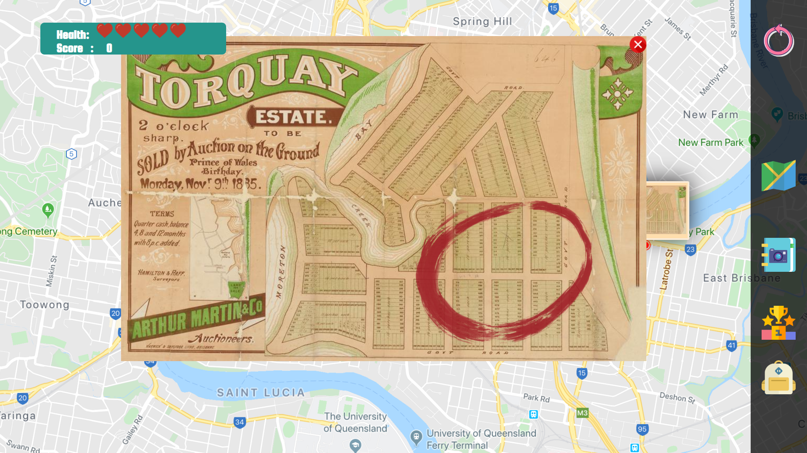
     
    
在不同地图上的区域内探索

    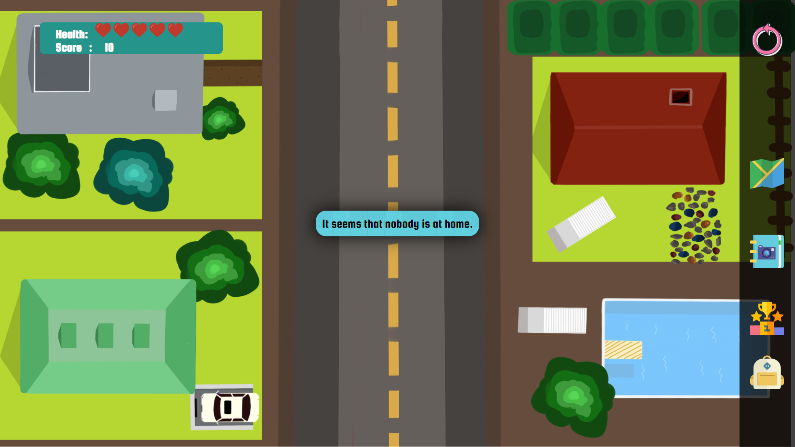
     
    
街道场景

    
     
    
室内场景

    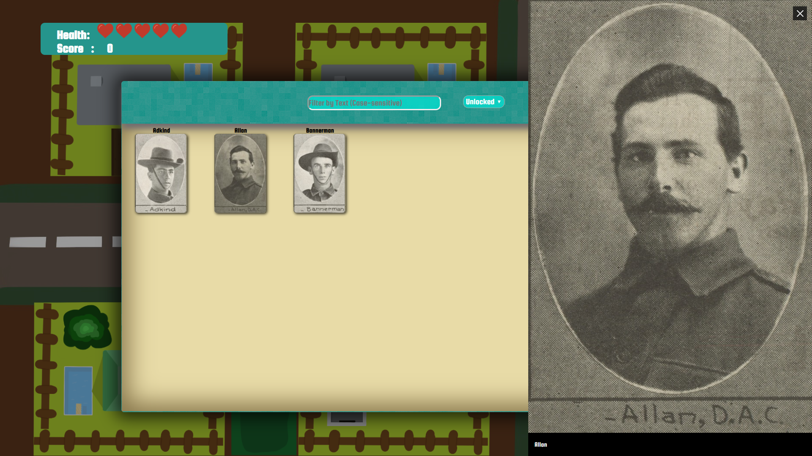
     
    
查看已有士兵照片

### 项目内容展示  

    

 

### 游戏素材
为了使游戏画面更加有吸引力，我手绘和PS了一些游戏内部的素材，主要分为：室内场景和室外场景两种。

1. 室外场景  
室外场景主要为探索地图中不同区域的街道，其中有可交互的房屋以及装饰的花园、车辆等。  
以下为不同的小元素块以及拼接后的效果：

    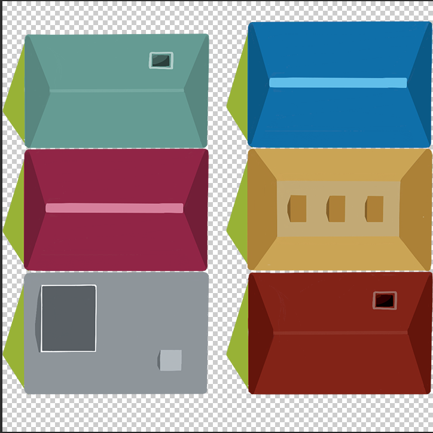

  

    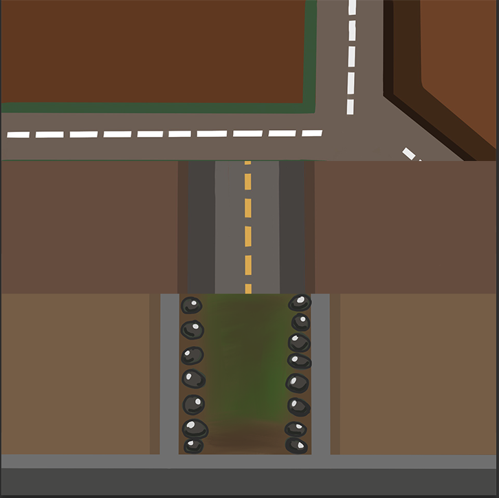

  

    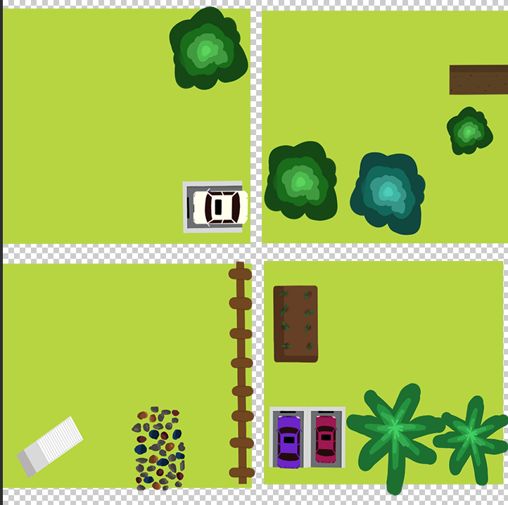

  

    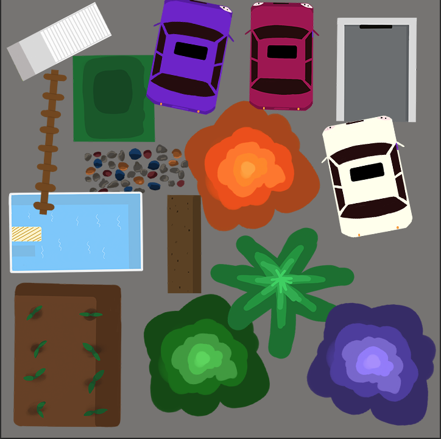

2. 室内场景  
室内场景以房间、遇到的npc为主。  
以下为不同的房间布局：  

    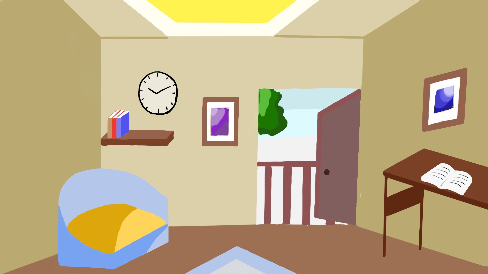

  

    

  

