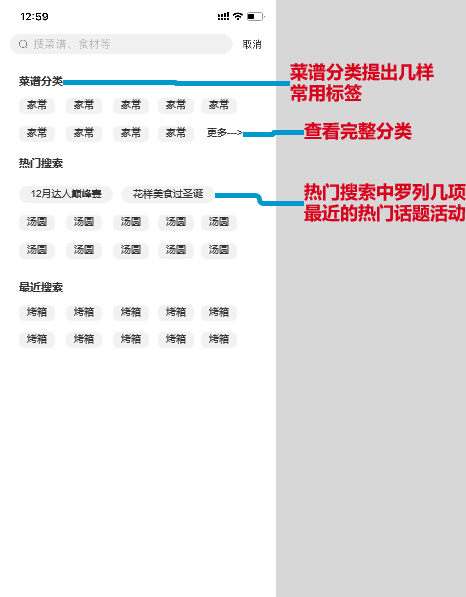

# 香哈菜谱搜索结果竞品分析  

<!-- START doctoc generated TOC please keep comment here to allow auto update -->
<!-- DON'T EDIT THIS SECTION, INSTEAD RE-RUN doctoc TO UPDATE -->

  - [一、项目背景](#%E4%B8%80%E9%A1%B9%E7%9B%AE%E8%83%8C%E6%99%AF)
  - [二、竞品概述](#%E4%BA%8C%E7%AB%9E%E5%93%81%E6%A6%82%E8%BF%B0)
    - [2.1 数据对比](#21-%E6%95%B0%E6%8D%AE%E5%AF%B9%E6%AF%94)
    - [2.2 竞品对比](#22-%E7%AB%9E%E5%93%81%E5%AF%B9%E6%AF%94)
    - [2.3 产品体验版本号](#23-%E4%BA%A7%E5%93%81%E4%BD%93%E9%AA%8C%E7%89%88%E6%9C%AC%E5%8F%B7)
  - [三、竞品功能对比](#%E4%B8%89%E7%AB%9E%E5%93%81%E5%8A%9F%E8%83%BD%E5%AF%B9%E6%AF%94)
      - [3.1 搜索界面](#31-%E6%90%9C%E7%B4%A2%E7%95%8C%E9%9D%A2)
      - [3.2 搜索结果](#32-%E6%90%9C%E7%B4%A2%E7%BB%93%E6%9E%9C)
  - [四、总结](#%E5%9B%9B%E6%80%BB%E7%BB%93)
    - [3.1 SWOT分析](#31-swot%E5%88%86%E6%9E%90)
    - [3.2 迭代方向](#32-%E8%BF%AD%E4%BB%A3%E6%96%B9%E5%90%91)
  - [五、改进建议](#%E4%BA%94%E6%94%B9%E8%BF%9B%E5%BB%BA%E8%AE%AE)
    - [4.1改善搜索界面](#41%E6%94%B9%E5%96%84%E6%90%9C%E7%B4%A2%E7%95%8C%E9%9D%A2)
    - [4.2给搜索结果界面增加分类功能](#42%E7%BB%99%E6%90%9C%E7%B4%A2%E7%BB%93%E6%9E%9C%E7%95%8C%E9%9D%A2%E5%A2%9E%E5%8A%A0%E5%88%86%E7%B1%BB%E5%8A%9F%E8%83%BD)

<!-- END doctoc generated TOC please keep comment here to allow auto update -->

## 一、项目背景  
在香哈菜谱APP的体验过程中，有很多人认为在搜索菜谱时，搜索结果有些眼花缭乱，难以定位到自己想要的内容。因此，为优化香哈菜谱的搜索结果展示，特展开此竞品分析。  

## 二、竞品概述  
### 2.1 数据对比  
此次分析中，我选择了豆果美食APP与小红书APP进行分析。下面对此三款产品进行排名、使用人群等对比。   
通过移动端APP指数对比，可看出美食外卖分类下，关于菜谱类排名第一的是下厨房，其次分别为豆果、香哈。  

>  
> *数据来源 艾瑞数据*  

其中，香哈APP虽在月独立设备数上稍有落后，但环比增幅却相对较高。 

>  
> *数据来源 艾瑞数据* 

在用户性别的数据上，香哈、豆果以及小红书的女生用户占比均较高。 其中小红书的女性用户比例最高。  

>   
> *数据来源 艾瑞数据*

在用户年龄的数据上，香哈和豆果的用户集中在25~30岁，而小红书的用户分群为24岁以下以及25~30岁的人群。 

>   
> *数据来源 艾瑞数据*   

### 2.2 竞品对比  
通过对比竞品数据等，可看出其区别如下图所示。  

  
 

可见，豆果美食定位与目标用户与香哈菜谱基本一致，为香哈菜谱的**直接竞争对手**。而小红书主打年轻女性的生活分享，与香哈菜谱的目标用户有所重叠；于此同时，小红书主打图片+视频的UGC生活分享，与香哈菜谱的功能上相似，因此小红书为香哈菜谱的**间接竞争对手**。

### 2.3 产品体验版本号  
  

## 三、竞品功能对比  

#### 3.1 搜索界面  

>       
>   **三款APP搜索界面对比**

a. 香哈的搜索界面含有热搜、最近搜索、菜谱分类以及三餐推荐等栏目。其中热搜需用左滑方式查看。菜谱分类全面，但菜谱分类中的搜索栏与搜索界面的搜索栏展示的是同样的内容。  

b. 豆果的搜索界面展示了搜索历史以及热门搜索两项信息。  

c. 小红书的搜索界面与豆果类似，展示了搜索历史、探索发现（热搜）。除此之外，小红书还展示了年度城市榜单的活动链接。  

通过对比可以看出，香哈菜谱虽想推荐自己的话题广场，但在热搜中并没有体现出来。于此对比，豆果以及小红书均展示了自己的热门话题。  

#### 3.2 搜索结果  
a. 通过主搜索栏搜索词条“圣诞”，香哈显示的信息为导航”综合”下，主要是视频+菜谱的混合展示。而菜谱分类下为图片+描述的菜谱信息流展示。  

>  
> **香哈菜谱搜索结果页面**   

>  
>  **香哈菜谱搜索结果站点地图**

b. 豆果展示的“圣诞”的词条结果分为主导航和次级导航两部分。在“菜谱”分类下，有“综合”、“收藏高”和“学做多“不同的排序方式以及”视频“分类。但视频分类下没有进一步的分类方式。

>   
> **豆果美食搜索结果页面**    

>  
> **豆果美食搜索结果站点地图**  

c. 小红书的“发布“导航下，将信息分为”图片“以及”视频“两种，每种分类下都可根据”热度“”新发布“进行进一步的分类。除此之外，在页面顶端还展示了与”圣诞“词条相关联的活动链接。  

>  
> **小红书搜索结果页面**      

>  
> **小红书搜索结果站点地图**    

通过搜索结果的站点地图对比发现，香哈菜谱缺少次级导航，搜索结果的排序单一，可供选择性有限。  

## 四、总结   
### 3.1 SWOT分析
基于上述，我们先对香哈菜谱进行SWOT分析： 

    

### 3.2 迭代方向  

通过以上分析，香哈菜谱可以从以下几个方向进行迭代： 
1. 优化小视频的观看体验，打造以做菜为主，生活分享为辅的菜谱平台。
2. 优化搜索逻辑，展示更多用户希望看到的内容。
3. 改善产品内部结构，运营模块、电商展示突出化，提高转化率。 

## 五、改进建议  

以下为对于香哈菜谱APP搜索界面以及搜索结果界面的具体建议，主要通过增加次级标题、筛选框以及标签的方式优化搜索的浏览体验。 

### 4.1改善搜索界面 
可将搜索界面分为“菜谱分类”，“热门搜索”以及“最近搜索”三块，每块内容块中填入一些相对应的关键词。 

   

首先，可列出菜谱分类中一些常用键入词，引导用户去选择或点击查看更多。另外，可将热门搜索中放入一些近日热门话题或活动的关键词。  

### 4.2给搜索结果界面增加分类功能  

将搜索界面导航的逻辑进行进一步梳理。在右上角添加筛选功能、增加次级导航（图文或视频）、排序功能以及小标签。  
当选择图文时，可选的筛选方式为“只看我关注的人”。 

    

当选择视频时，可选的筛选方式为“只看菜谱”和“只看我关注的人”。这样可以方便搜索做菜教程的人快速定位到自己想要的内容。  

   
