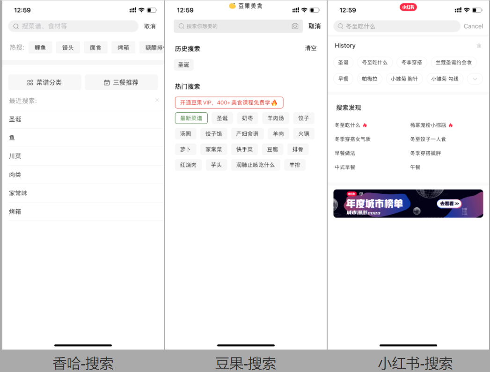

# 香哈菜谱搜索结果竞品分析
## 一、项目背景  
在香哈菜谱APP的体验过程中，有很多人认为在搜索菜谱时，搜索结果有些眼花缭乱，难以定位到自己想要的内容。因此，为优化香哈菜谱的搜索结果展示，特展开此竞品分析。  

## 二、竞品概述  
### 2.1 竞品对比  
此次分析中，我选择了直接竞争者豆果美食APP与间接竞争者小红书APP进行分析。下面对此三款产品进行定位、目标用户等对比。  

  

可见，豆果美食定位与目标用户与香哈菜谱基本一致，为香哈菜谱的直接竞争对手。而小红书主打年轻女性的生活分享，与香哈菜谱的目标用户有所重叠；于此同时，小红书主打图片+视频的UGC生活分享，与香哈菜谱的功能上相似，因此小红书为香哈菜谱的间接竞争对手。
### 2.2 月度独立设备数对比  
好烦，没写
### 2.3 产品版本号  
  
### 2.4 竞品功能对比  

#### 2.4.1 搜索界面  
>  **图注 xxxsxx**
>     

a. 香哈的搜索界面含有热搜、最近搜索、菜谱分类以及三餐推荐等栏目。其中热搜需用左滑方式查看。菜谱分类全面，但菜谱分类中的搜索栏与搜索界面的搜索栏展示的是同样的内容。  

b. 豆果的搜索界面展示了搜索历史以及热门搜索两项信息。  

c. 小红书的搜索界面与豆果类似，展示了搜索历史、探索发现（热搜）。除此之外，小红书还展示了年度城市榜单的活动链接。  

通过对比可以看出，香哈菜谱虽想推荐自己的话题广场，但在热搜中并没有体现出来。于此对比，豆果以及小红书均展示了自己的热门话题。  

#### 2.4.2 搜索结果  
a. 通过主搜索栏搜索词条“圣诞”，香哈显示的信息为导航”综合”下，主要是视频+菜谱的混合展示。而菜谱分类下为图片+描述的菜谱信息流展示。  

>  
> **香哈菜谱搜索结果页面**   

>  
>  **香哈菜谱搜索结果站点地图**

b. 豆果展示的“圣诞”的词条结果分为主导航和次级导航两部分。在“菜谱”分类下，有“综合”、“收藏高”和“学做多“不同的排序方式以及”视频“分类。但视频分类下没有进一步的分类方式。

>   
> **豆果美食搜索结果页面**    

>  
> **豆果美食搜索结果站点地图**  

c. 小红书的“发布“导航下，将信息分为”图片“以及”视频“两种，每种分类下都可根据”热度“”新发布“进行进一步的分类。除此之外，在页面顶端还展示了与”圣诞“词条相关联的活动链接。  

>  
> **小红书搜索结果页面**      

>  
> **小红书搜索结果站点地图**    

通过搜索结果的站点地图对比发现，香哈菜谱缺少次级导航，搜索结果的排序单一，可供选择性有限。  

## 四、总结
基于上述，我们先对香哈菜谱进行SWOT分析： 
 
    

在此分析的基础上，可以给出以下改进方式:  

**改善搜索界面**  
可将搜索界面分为“菜谱分类”，“热门搜索”以及“最近搜索”三块，每块内容块中填入一些相对应的关键词。 

   

首先，可列出菜谱分类中一些常用键入词，引导用户去选择或点击查看更多。另外，可将热门搜索中放入一些近日热门话题或活动的关键词。  

**给搜索结果界面增加分类功能**    

将搜索界面导航的逻辑进行进一步梳理。在右上角添加筛选功能、增加次级导航（图文或视频）、排序功能以及小标签。  
当选择图文时，可选的筛选方式为“只看我关注的人”。 

    

当选择视频时，可选的筛选方式为“只看菜谱”和“只看我关注的人”。这样可以方便搜索做菜教程的人快速定位到自己想要的内容。  

   

以上为对于香哈菜谱APP搜索界面以及搜索结果界面的迭代建议，主要通过增加次级标题、筛选框以及标签的方式优化搜索的浏览体验。